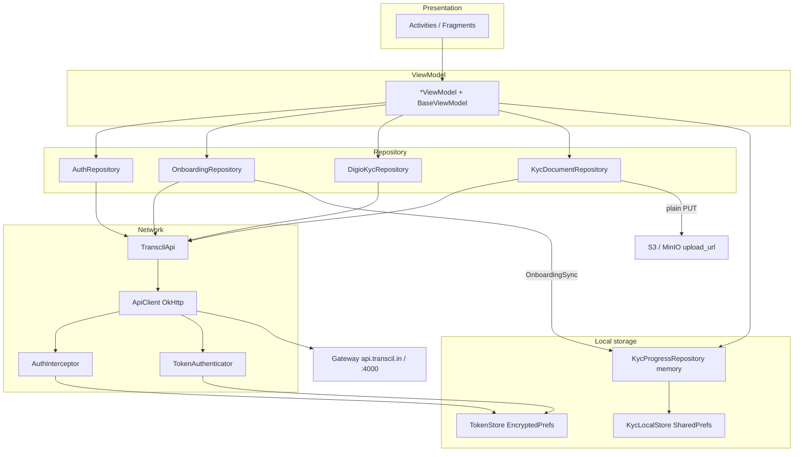
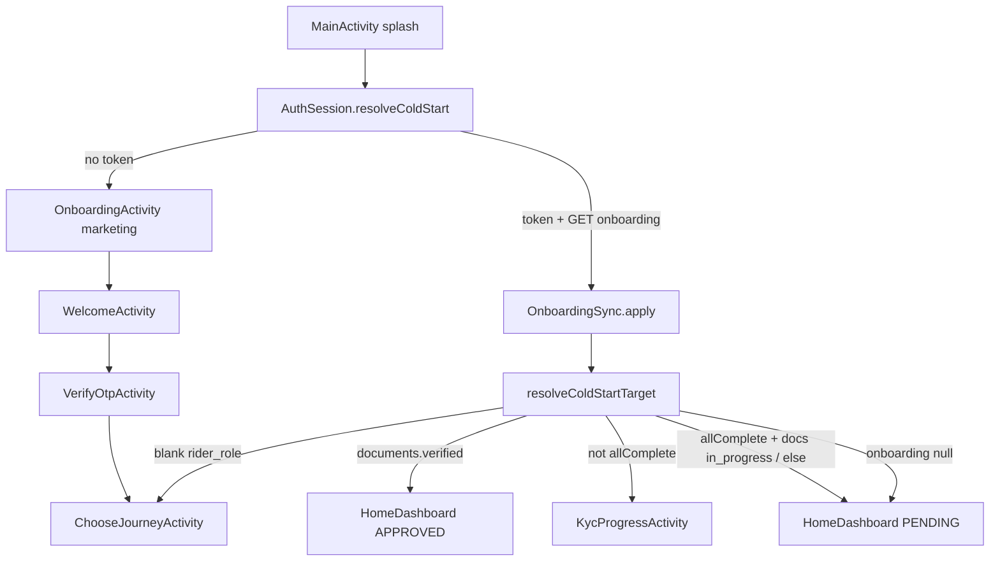
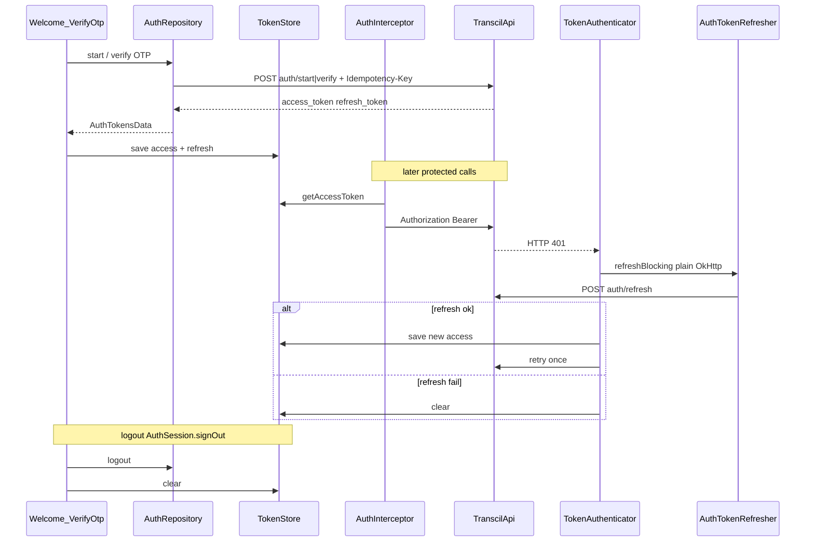
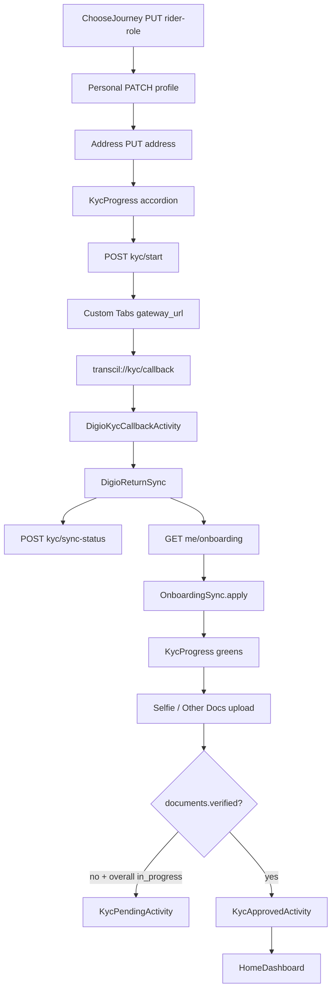
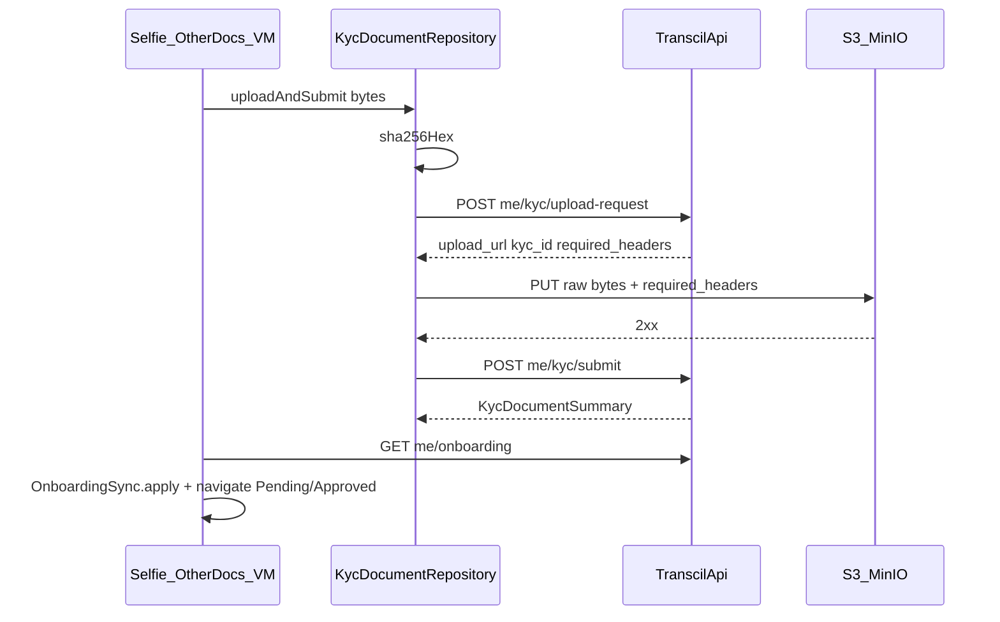
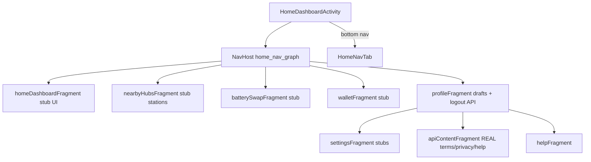

# TranscilMobileApp — Architecture & Knowledge Deep Dive

**Date:** 2026-07-29  
**App:** `TranscilMobileApp` (`com.example.transcilmobileapp`)  
**Audience:** Engineers learning the codebase end-to-end  
**Status:** Analysis dump grounded in code + Phase C / identity specs. No implementation.

**Primary contracts read:**

1. `docs/superpowers/specs/2026-07-28-phase-c-kyc-digio-integration-guide.md`
2. `docs/superpowers/specs/2026-07-24-android-identity-digio-wiring-design.md`

**Locked truths:**

- Architecture is **MVVM + Repository + Retrofit/OkHttp/Gson**, with **no DI framework** (manual construction).
- Navigation is **hybrid**: Intent stack for splash/auth/journey/KYC; Navigation Component only inside the home shell.
- **Server is completion authority** for KYC: `GET /v1/me/onboarding` + `OnboardingSync.apply`. Local caches are not truth.
- Digio KYC is Custom Tabs + backend `/v1/kyc/*` (no Digio SDK / vendor secrets on device).
- Tokens live in **EncryptedSharedPreferences** (`TokenStore`). Non-secret KYC drafts may use plain SharedPreferences (`KycLocalStore`).
- Gson maps JSON snake_case ↔ Kotlin properties via `@SerializedName`.

**Packages covered:** `TranscilApp` (root) · `auth` · `splash` · `onboarding` · `journey` · `kyc` · `home` · `rental` · `payment` · `repository` · `core` · `data/network` · `data/local` · `data/model` (+ `auth` / `onboarding` / `kyc`) · `demo`

---

## 1) Executive map

- **TranscilMobileApp** is a native Kotlin Android rider app (`com.example.transcilmobileapp`) for EV rental / 3PL onboarding and post-KYC home shell.
- **Users:** riders choosing **RENT_EV** (`rider`) or **THREE_PL** (`3pl`) after phone OTP login.
- **Spine:** MVVM + thin Repositories + Retrofit/OkHttp/Gson; **no DI** — `ApiClient` singleton + default ctor injection.
- **Identity/KYC** talks to the Transcil **gateway** (`BuildConfig.BASE_URL`, prod `https://api.transcil.in/`; local via emulator `10.0.2.2:4000`). Digio runs in **Custom Tabs**; app never holds Digio secrets.
- **Completion authority:** `GET /v1/me/onboarding` → `OnboardingSync.apply`. `KycProgressRepository` / `KycLocalStore` are cache/draft only.
- **Package ownership:** `auth`/`splash`/`onboarding`/`journey` = entry + session; `kyc` + `repository` = verification funnel; `home` = Nav-shell dashboard; `rental`/`payment` = UI shells (mostly local catalog); `data.*` = network/storage/DTOs; `core` = shared bases/enums/nav helpers.
- **Navigation hybrid:** Intent stack through splash→auth→journey→KYC; Navigation Component only inside `HomeDashboardActivity`.
- **Tokens** in `EncryptedSharedPreferences` (`TokenStore`); bearer via `AuthInterceptor`; 401 refresh via `TokenAuthenticator`.

---

## 2) Mermaid diagrams

### A. Package / layer diagram

**Why this shape:** Thin repos keep Activities off Retrofit; OkHttp owns auth headers/refresh so ViewModels stay dumb. No DI keeps the young codebase small. Digio/S3 stay outside the JSON Retrofit client so vendor secrets and multipart never enter the app envelope.

---

### B. Cold-start + auth routing

**Why:** Cold start must survive process death using encrypted tokens + server onboarding, not in-memory KYC. Marketing onboarding is skipped when a session exists. `CLEAR_TASK` intents avoid stacking splash under home/KYC.

---

### C. Auth token lifecycle

**Why:** Cognito-backed OTP without Amplify; encrypted disk so restart keeps session; separate plain client for refresh avoids 401 loops; single-flight lock handles concurrent 401s.

---

### D. KYC happy path (Phase C)

**Why:** Digio-only for Aadhaar+Bank (Approach A) avoids dual-path drift. Server onboarding after sync prevents fake greens. Deep link matches Digio `redirect_url` so return works after Custom Tabs process handoff.

---

### E. Document upload pipeline

**Why:** Presign + plain PUT matches identity contract (not multipart through gateway). SHA-256 + required headers satisfy S3 signing; submit is separate so failed PUTs don’t create false KYC rows.

---

### F. Home shell

**Why:** One Activity + Nav graph for tab restore/state; Intent-based KYC stays outside so identity funnel can clear the task. Content pages reuse public GETs already on `TranscilApi`; ops features (wallet/swap/hubs) stay stubbed until later phases.

---

## 3) File / class catalog by package

### Root — `TranscilApp.kt`

| Item | Role / why / spine / deps |
|---|---|
| `TranscilApp` | `Application`; inits `TokenStore` + `KycLocalStore` before Activities. Depends on local stores; depended on by manifest `android:name`. |

### `auth`

| File | Role | Why | Key spine | Depends / depended |
|---|---|---|---|---|
| `AuthSession` | Cold-start + logout glue | Server onboarding → destination without Activity logic | `ColdStartTarget`, `resolveColdStart`, `resolveColdStartTarget`, `signOut`, `openSignedOut` | TokenStore, OnboardingRepository, OnboardingSync, KycProgressRepository; used by MainActivity, Profile |
| `WelcomeActivity` / `WelcomeViewModel` | Phone entry → OTP start | Thin UI over AuthRepository | `onSendOtpClicked` | AuthRepository → VerifyOtp |
| `VerifyOtpActivity` / `VerifyOtpViewModel` | OTP verify → persist tokens | Session boundary | `onVerifyClicked` → `TokenStore.save` | AuthRepository, TokenStore → ChooseJourney |

### `splash`

| File | Role | Why | Spine | Deps |
|---|---|---|---|---|
| `MainActivity` | Branded splash then route | Single launcher entry | `navigateAfterSplash` → `AuthSession.resolveColdStart` | AuthSession, BaseActivity |

### `onboarding` (marketing — not `/me/onboarding`)

| File | Role | Why | Spine | Deps |
|---|---|---|---|---|
| `OnboardingActivity` / `OnboardingViewModel` | 3-slide marketing carousel | Pre-auth product story | pages → `navigateToWelcome` | → WelcomeActivity |

### `journey`

| File | Role | Why | Spine | Deps |
|---|---|---|---|---|
| `ChooseJourneyActivity` / `ChooseJourneyViewModel` | RENT_EV vs THREE_PL | Server role via `PUT /v1/me/rider-role` | `setRiderRole`, `startJourney` | OnboardingRepository, KycProgressRepository → CreatePersonalAccount |

### `kyc` (largest)

| File / object | Role | Why |
|---|---|---|
| `KycProgressActivity` + `KycProgressViewModel` | Accordion hub: refresh onboarding, Digio launch, inline forms, other-docs upload, status redirect | Single place for progress UX |
| `KycProgressRepository` | In-memory drafts + step UI state | Fast accordion; overwritten by OnboardingSync |
| `OnboardingSync` | Maps `OnboardingData` → local drafts/completion | Server = truth |
| `DigioReturnSync` | sync-status then onboarding refresh | Phase C correction vs mark-local-complete |
| `DigioKycCallbackActivity` | Deep-link receiver | `transcil://kyc/callback` |
| `DigioLauncher` | Custom Tabs open | No Digio SDK |
| `CreatePersonalAccount*` | Personal details | PATCH profile |
| `AddressDetails*` | Address | PUT address + states/cities |
| `AadhaarVerification*` / `AadhaarOtp*` | Legacy/direct Aadhaar UI | Phase C: Digio happy path; OTP dormant |
| `BankDetails*` | Bank form + local IFSC draft | Digio primary; local-only bank completion still in repo (`ponytail`) |
| `PanVerification*` | 3PL PAN | `verifyPan` |
| `SelfieVerification*` | Selfie capture → upload pipeline | Docs gate |
| `OtherDocsCatalog` / validators | Doc type labels + validation | From onboarding `options.doc_types` |
| `KycPendingActivity` / `KycApprovedActivity` | Review / approved gates | Driven by `documents.*` |
| `KycFlowNavigator` / `KycStepModels` | Step intents + catalog | Local step order by journey |
| `KycStepCatalog` | Hard-coded step lists per journey | UI order; completion still from server keys |

Depends on: repositories, TokenStore indirectly, KycLocalStore. Depended on by: AuthSession, home Profile (documents browse).

### `home`

| File | Role | API? |
|---|---|---|
| `HomeDashboardActivity` | Shell + bottom nav | Nav only |
| `HomeDashboardFragment` / ViewModel | Home tab | Stub name/id from drafts |
| `NearbyHubs*` / `BatterySwap*` / `Wallet*` | Ops tabs | **In-memory stubs** |
| `Profile*` | Profile + logout | Logout → AuthSession; display from drafts |
| `ApiContent*` / `Help*` | Terms/privacy/help | **Real** `TranscilApi` GETs |
| `Settings*` | Settings menu | Mostly stubs |
| `RentalCatalog` / `HomeModels` | Shared demo catalog | Local prices for rental/payment |

### `rental` / `payment`

| Package | Role | Why |
|---|---|---|
| `VehiclesActivity`, `RentalPlans*` | Catalog UI | Local `RentalCatalog`; not booking API |
| `PaymentActivity` / `PaymentViewModel` | Fake pay → autopay → success steps | UI prototype; no payment API |

### `repository`

| Class | Owns | Maps |
|---|---|---|
| `AuthRepository` | `/v1/auth/*`, `toE164` | Envelope errors → Result |
| `OnboardingRepository` | journey, role, profile, address, onboarding, reference, PAN, states/cities | UI DOB/gender ↔ API |
| `DigioKycRepository` | `/v1/kyc/start|sync` | Validates customer_name; fixed redirect URL |
| `KycDocumentRepository` | upload-request → S3 PUT → submit | SHA-256, required headers |
| `DemoRepository` | Demo ping | Early networking sample |

### `core`

| Symbol | Role |
|---|---|
| `BaseActivity` | ViewBinding inflate + window insets |
| `BaseViewModel` | `isLoading` / `errorMessage` LiveData |
| `JourneyType`, `Gender`, `KycStatus` | Shared enums |
| `KycNavigator` | Pending/Approved/Home Intents |
| `NavExtras`, `OtpInput`, `FeedbackUi`, `UiFormHelpers`, `SegmentedStepper` | Cross-cutting UI helpers |

### `data/network`

| Class | Role |
|---|---|
| `ApiClient` | Retrofit + OkHttp (interceptor, authenticator, debug logging) |
| `TranscilApi` | All gateway endpoints |
| `AuthInterceptor` | Bearer attach |
| `TokenAuthenticator` + `AuthTokenRefresher` | 401 → refresh once |
| `DemoApi` | Demo endpoints |

### `data/local`

| Class | Role |
|---|---|
| `TokenStore` | Encrypted access/refresh + memory cache |
| `KycLocalStore` | Plain prefs bank draft (process death) |

### `data/model`

| Area | Role |
|---|---|
| `ApiResponse` / `ApiMeta` / `ApiError` | Envelope |
| `auth/AuthDtos` | OTP/token bodies |
| `onboarding/OnboardingDtos` | Onboarding + profile/address/journey |
| `kyc/DigioDtos`, `KycDocumentDtos` | Digio + upload |
| `PublicContentDtos` | Terms/privacy/help |

### `demo`

| File | Role |
|---|---|
| `DemoViewModel` | Early Retrofit smoke sample via `DemoRepository` |

---

## 4) Concept deep-dives

### 1. SharedPreferences vs EncryptedSharedPreferences

- **`TokenStore`** (`data/local/TokenStore.kt`): `EncryptedSharedPreferences` + `MasterKey` AES256; keys `access_token` / `refresh_token`; in-memory mirror for OkHttp threads. **Why encrypt:** bearer/refresh are session secrets; disk readable otherwise.
- **`KycLocalStore`**: plain `SharedPreferences` (`transcil_kyc_local`) for bank draft fields + completed subtitle. **Why not encrypt:** non-secret UX draft / IFSC path survival across process death; Phase C still forbids persisting full Aadhaar/PAN/OTP — bank account in plain prefs is a known trade-off for the local IFSC path (`ponytail` in `KycProgressRepository`).
- **Logout** (`AuthSession.signOut`): best-effort `authRepository.logout()`, then `TokenStore.clear()`, `KycProgressRepository.clearAuthLocal()` (resets memory + `KycLocalStore.clear()`). Lands on `WelcomeActivity` via `openSignedOut` (not marketing onboarding).

### 2. `@SerializedName`

Gateway identity JSON is **snake_case**; Kotlin idioms are **camelCase**. Gson needs explicit names (or a field-naming policy — this app uses annotations).

Examples:

- Auth: `phone_e164` → `phoneE164`; `access_token` → `accessToken` (`AuthDtos.kt`)
- Onboarding: `rider_role`, `overall_percent`, `completed_at`, `edit_endpoint` (`OnboardingDtos.kt`)
- Digio: `gateway_url`, `redirect_url`, `customer_name` (`DigioDtos.kt`)

**Alternate names:** `ApiMeta.requestId` uses `@SerializedName(value = "requestId", alternate = ["request_id"])` so older camelCase content responses and identity snake_case both parse. Same pattern on `sort_order` / `state_code` in reference DTOs.

### 3. MVVM here

- **`BaseActivity`**: inflates ViewBinding, safe insets — Activities observe LiveData and call VM methods.
- **`BaseViewModel`**: shared loading/error; feature VMs add navigation LiveData (`VerifyOtpViewModel.navigateToChooseJourney`).
- Work runs in `viewModelScope.launch`; UI must not call Retrofit — pattern is VM → Repository → `ApiClient.transcilApi`. Exception: `ApiContentViewModel` calls `ApiClient.transcilApi` directly (small YAGNI for public HTML).

### 4. Repository layer

| Layer | Owns |
|---|---|
| **Validators** (`*Validator.kt`) | Pure field rules (regex, lengths, consent) |
| **ViewModels** | UX orchestration, when to navigate, toast, loading |
| **Repositories** | E.164/`+91`, DOB format, Idempotency-Key UUIDs, envelope `error` → `Result.failure`, Digio name validation, S3 PUT |

### 5. Idempotency-Key, AuthInterceptor, TokenAuthenticator

- **Idempotency-Key:** UUID per logical POST/PUT (auth, Digio, profile, uploads). Prevents duplicate Digio sessions / KYC rows on retries. Reuse only when retrying the same action after timeout (contract).
- **AuthInterceptor:** attaches Bearer when token present; public GETs work pre-login.
- **TokenAuthenticator:** on 401, skip refresh path, cap one retry, single-flight; uses **plain** `AuthTokenRefresher` OkHttp (no authenticator) to avoid loops; clears tokens on hard failure so next cold start → marketing/onboarding path without zombie Bearer.

### 6. OnboardingSync vs KycProgressRepository

- **Source of truth:** server `OnboardingData` via `OnboardingRepository.getOnboarding()`.
- **`OnboardingSync.apply`:** maps `steps[].key/status/fields` into drafts + `syncStepStatuses`; restores bank from `KycLocalStore` first so local-only bank isn’t wiped.
- **`KycProgressRepository`:** session drafts, accordion `uiSteps()`, sequencing `canOpen`; **not** authority for “step complete” after Digio (Phase C). DigioReturnSync always refreshes onboarding rather than `markCompleted` from Digio alone.

**Doc vs code:** Phase B design (2026-07-24) said Digio sync may mark Aadhaar/Bank locally. Phase C guide (2026-07-28) + `DigioReturnSync` are **newer** — onboarding-only completion.

### 7. Intent vs Navigation Component

- **Identity funnel** = linear, rare back-stack restore needs, deep links, task clears → Activities + Intents.
- **Home** = multi-tab with nested Settings/Help → `home_nav_graph.xml` + bottom nav state restore. Keeps Navigation dependency scoped to the shell.

### 8. Process death / resume

| Survives | Dies |
|---|---|
| Encrypted tokens (`TokenStore`) | In-memory drafts (personal/address/…) unless rehydrated from onboarding |
| `KycLocalStore` bank draft | Accordion expand state, pending selfie bytes in VM |
| Server onboarding (refetch on cold start / `KycProgressViewModel.refresh`) | Digio Custom Tabs mid-flow (return via deep link) |

Cold start with token: `MainActivity` → `resolveColdStart` → GET onboarding → `OnboardingSync.apply` → correct Activity.

---

## 5) End-to-end runtime walkthroughs

### 1. First install → session saved

`MainActivity` splash → `AuthSession.resolveColdStart` (no token) → `OnboardingActivity` → Get Started → `WelcomeActivity` → `WelcomeViewModel.onSendOtpClicked` → `AuthRepository.start` (`+91…`) → `VerifyOtpActivity` → `VerifyOtpViewModel.onVerifyClicked` → `AuthRepository.verify` → `TokenStore.save` → `ChooseJourneyActivity`.

### 2. Choose journey → KYC accordion

`ChooseJourneyViewModel.onContinueClicked` → `setRiderRole` → `KycProgressRepository.startJourney` → `CreatePersonalAccount*` (`patchProfile`) → address → `KycProgressActivity`. Accordion from `KycStepCatalog` + server statuses via `refresh` → `OnboardingSync.apply`.

### 3. Digio return → greens

Aadhaar/Bank CTA → `DigioKycRepository.start` → `DigioLauncher.open(gateway_url)` → Digio → deep link → `DigioKycCallbackActivity` → `DigioReturnSync.applyAfterReturn` (sync-status + getOnboarding + `OnboardingSync.apply`) → `KycProgressActivity` with updated completes / in_progress.

### 4. Selfie / other docs → Home

`SelfieVerificationViewModel.onContinue` or other-docs path in `KycProgressViewModel` → `KycDocumentRepository.uploadAndSubmit` → GET onboarding → if not verified → `KycPendingActivity` / PENDING home; if `documents.verified` → `KycApprovedActivity` → `KycNavigator.openHomeDashboard`.

### 5. Cold start with valid token

Splash → `shouldRestoreSession` true → `getOnboarding` → `OnboardingSync.apply` → `resolveColdStartTarget`: blank role → ChooseJourney; verified → Home APPROVED; incomplete steps → KycProgress; else Home PENDING.

### 6. Mid-session 401

Protected call 401 → `TokenAuthenticator.authenticate` → `AuthTokenRefresher.refreshBlocking` → success: `TokenStore.save` + retry; fail: `TokenStore.clear` (next navigation/cold start treats as logged out). UI does not implement refresh itself.

### 7. Logout

Profile → `ProfileViewModel.onLogout` → `AuthSession.signOut` (API logout best-effort, clear tokens + KYC local) → `AuthSession.openSignedOut` → `WelcomeActivity` with `NEW_TASK|CLEAR_TASK`.

---

## 6) What is NOT backed by API yet

- Home dashboard quick actions / stub Transcil ID (`HomeDashboardViewModel`)
- Nearby hubs, battery swap, wallet (dedicated stub repositories)
- Profile edit, many settings toggles, support stubs
- Rental vehicles/plans + Payment flow (`RentalCatalog` + local state machine)
- Direct Aadhaar OTP happy path / `POST /v1/me/bank-account` (Phase C out of scope)
- Booking, real wallet money, hub maps (Phase C doc: out of scope)

**Is API-backed:** auth, Digio KYC, onboarding/profile/address/reference/PAN, document upload, public content (terms/privacy/help/settings GETs).

---

## 7) Project term cheatsheet

| Term | Definition here | Where | Why it matters |
|---|---|---|---|
| **Transcil** | Rider EV rental / 3PL platform; this is the Android client | App + `api.transcil.in` | Product name / API host |
| **KYC** | Know-your-customer verification funnel | `kyc/*`, `/v1/kyc/*`, `/v1/me/kyc/*` | Gate to Home |
| **Digio** | Hosted Aadhaar+Bank KYC vendor via backend | `DigioKycRepository`, Custom Tabs | No Digio SDK/secrets on device |
| **Aadhaar** | National ID step; Digio-hosted | Step key `aadhaar`, `KycStep.AADHAAR` | Identity verify |
| **PAN** | Tax ID; 3PL one-shot verify | `verifyPan`, `KycStep.PAN` | 3PL checklist |
| **IFSC** | Bank branch code in local bank draft | `BankDraft.ifsc`, `KycLocalStore` | Local bank form UX |
| **OTP** | SMS one-time password for login (and dormant Aadhaar OTP UI) | `AuthRepository`, VerifyOtp | Auth entry |
| **e164** | `+91` + 10 digits phone form | `AuthRepository.toE164`, reference `mobile_e164` | API phone format |
| **RENT_EV / rider** | Rental journey / API role `rider` | `JourneyType.RENT_EV`, `toRiderRole` | Step set + product |
| **THREE_PL / 3pl** | Logistics journey / API role `3pl` | `JourneyType.THREE_PL` | Includes PAN; different catalog |
| **Onboarding (marketing)** | Pre-login carousel | `onboarding/OnboardingActivity` | Not the API resource |
| **Onboarding (API)** | `GET /v1/me/onboarding` progress | `OnboardingData`, `OnboardingRepository` | Completion authority |
| **OnboardingSync** | Apply API onboarding → local drafts/status | `kyc/OnboardingSync.kt` | Prevents fake greens |
| **DigioReturnSync** | Post-deep-link sync + onboarding refresh | `kyc/DigioReturnSync.kt` | Digio return contract |
| **KycProgressRepository** | In-memory KYC drafts + UI step state | `kyc/KycProgressRepository.kt` | Cache/draft, not truth |
| **KycLocalStore** | Plain prefs bank draft | `data/local/KycLocalStore.kt` | Survives process death |
| **TokenStore** | Encrypted access/refresh tokens | `data/local/TokenStore.kt` | Session persistence |
| **EncryptedSharedPreferences** | AES-backed prefs for secrets | TokenStore via `security-crypto` | Token at rest |
| **SharedPreferences** | Plain prefs | KycLocalStore | Non-secret drafts |
| **ApiClient** | Retrofit/OkHttp singleton | `data/network/ApiClient.kt` | All API access |
| **TranscilApi** | Retrofit interface of gateway routes | `data/network/TranscilApi.kt` | Contract surface |
| **ApiResponse** | `{ data, meta, error }` envelope | `data/model/ApiResponse.kt` | Uniform parsing |
| **@SerializedName** | Gson JSON↔Kotlin name bridge | DTOs under `data/model` | snake_case APIs |
| **Idempotency-Key** | Per-action UUID header on mutating calls | Repos + `TranscilApi` `@Header` | Safe retries |
| **AuthInterceptor** | Adds `Authorization: Bearer` | `AuthInterceptor.kt` | Authenticated calls |
| **TokenAuthenticator** | 401 → refresh once → retry | `TokenAuthenticator.kt` | Session continuity |
| **AuthSession** | Cold-start routing + logout | `auth/AuthSession.kt` | Entry glue |
| **ColdStartTarget** | Sealed destinations after splash | `AuthSession.kt` | Testable routing |
| **Custom Tabs** | Chrome custom tab for Digio URL | `DigioLauncher`, `androidx.browser` | Safer than WebView |
| **gateway_url** | Digio start response URL to open | `DigioStartData.gatewayUrl` | Hosted KYC entry |
| **transcil://kyc/callback** | Digio redirect deep link | Manifest + `DIGIO_REDIRECT_URL` | Return to app |
| **documents.overall** | Doc review aggregate (`pending`/`in_progress`/…) | `OnboardingDocumentsStatus.overall` | Pending screen |
| **documents.verified** | Boolean unlock for approved Home | `OnboardingDocumentsStatus.verified` | Final gate |
| **presign / S3 PUT** | upload-request then binary PUT | `KycDocumentRepository` | Doc upload contract |
| **Other Docs** | Non-selfie KYC docs (voter/DL/PAN file) | `OTHER_DOCS`, `OtherDocsCatalog` | Rental checklist |
| **Reference** | Emergency contact for `rider` | `PUT /v1/me/reference`, `KycStep.REFERENCE` | Rental required step |
| **Phase A/B/C** | Delivery slices: auth wiring → Digio → full onboarding truth | Specs under `docs/superpowers/specs/` | Scope discipline |
| **ViewBinding / DataBinding** | Generated bindings; DataBinding enabled in Gradle | `BaseActivity`, `build.gradle.kts` | UI wiring |
| **MVVM** | UI ↔ ViewModel ↔ Repository | Throughout | Separation |
| **Repository pattern** | Thin API + mapping layer | `repository/*` | Testable boundary |
| **LiveData** | UI observation | ViewModels | Lifecycle-safe |
| **viewModelScope** | Coroutine scope tied to VM | ViewModels | Cancel on clear |
| **BuildConfig.BASE_URL** | Retrofit base; default prod | `app/build.gradle.kts` | Environment switch |
| **local gateway** | Docker nginx `:4000`; emulator `http://10.0.2.2:4000/` | Phase C guide; debug cleartext manifest | Local integration |
| **KycNavigator** | Pending/Approved/Home intents | `core/KycNavigator.kt` | Post-submit routing |
| **KycStepCatalog** | Local step order per journey | `kyc/KycStepModels.kt` | Accordion composition |
| **AuthTokenRefresher** | Blocking refresh without authenticator | `AuthTokenRefresher.kt` | Breaks refresh loops |
| **client_action** | Server hint for UI (`stay_on_screen`, etc.) | `ApiError.clientAction` | Error UX |
| **Browse-only KYC** | Profile → progress without status redirect | `EXTRA_BROWSE_ONLY` | Approved riders can view docs |

---

## Open questions / gaps

- **`KycStepCatalog` vs server `steps[]` order:** completion maps by key, but accordion order is still hard-coded (and 3PL order differs from Phase C’s “typical” list). Unclear if product will switch to server order only.
- **Local bank completion** (`markCompletedLocalOnly` + `KycLocalStore`) still conflicts with Phase C “don’t locally complete BANK” — intentional interim or leftover?
- **Cold start when onboarding fetch fails** (`onboarding == null` → Home PENDING): may strand users; error UX not obvious from code.
- **Release cleartext off** (`usesCleartextTraffic=false`) while prod URL is HTTPS — fine for prod; local HTTP needs debug build or BASE_URL override (not in checked-in `defaultConfig`).
- **Profile/home still show stub rider IDs** even after API profile exists — `getProfile` not wired into Profile bind yet.
