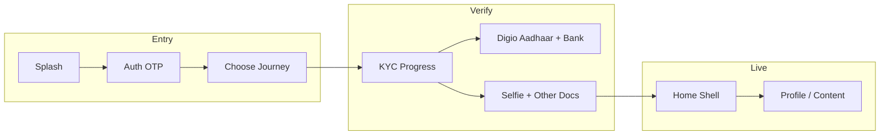
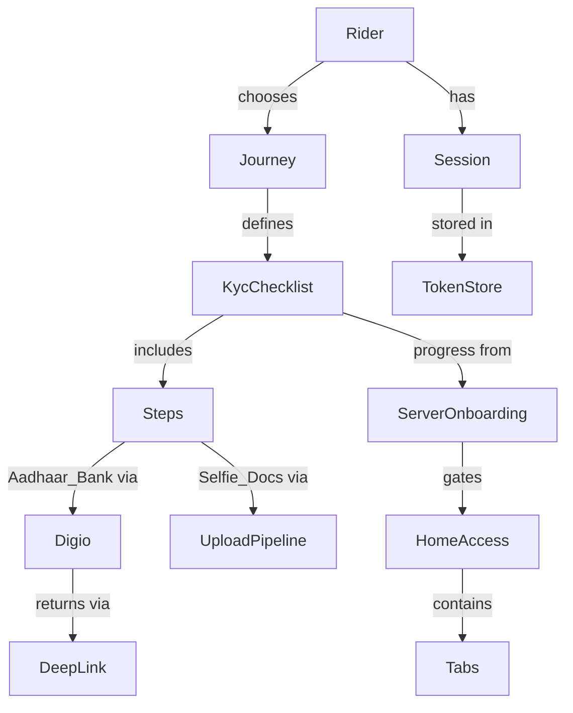
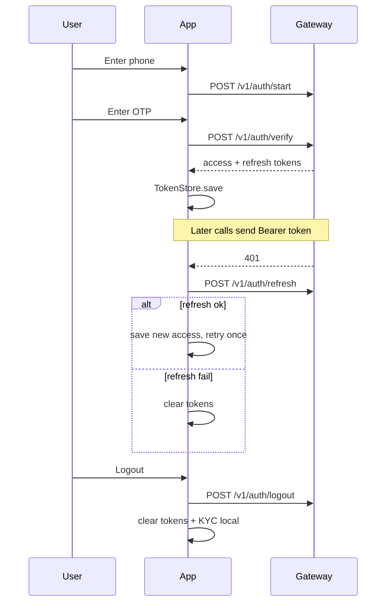

# Transcil Android — Product & Software Ontology

**Date:** 2026-07-29  
**App:** TranscilMobileApp (`com.transcil.rider`)  
**Audience:** Anyone who needs a shared mental model — product, design, backend, or Android  
**Companion:** Architecture deep-dive (class-level detail) lives beside this file  

---

## How to read this document

Every important idea appears in **three layers**:

| Layer | Meaning |
|---|---|
| **World** | The real-world / business concept (what a rider or ops person would say) |
| **App** | How the Android client names and stores it |
| **Wire** | The gateway API or protocol that carries it |

When layers disagree, **Wire (server) wins** for completion and verification. The app may cache drafts for UX, but the server is the authority.

---

## 1. What this app is

Transcil’s Android **rider** app lets a person:

1. Sign in with a phone OTP  
2. Choose a journey (**Rent EV** or **3PL**)  
3. Complete **KYC** (identity + documents)  
4. Enter a **Home** shell (hubs, battery swap, wallet, profile — some still local prototypes)

Identity / KYC traffic goes to the Transcil gateway (`api.transcil.in`). Digio runs in a browser tab; the phone never holds Digio secrets.

---

## 2. Big picture

**Spine in one sentence:** Splash decides where you are → Auth creates a session → Journey picks a role → KYC proves identity → Home is the post-verification product.

---

## 3. Core concepts (dictionary)

### 3.1 People & roles

| Concept | World | App | Wire |
|---|---|---|---|
| **Rider** | The end user of this app | Profile drafts, home greeting | `rider_id`, `GET/PATCH /v1/me/profile` |
| **Journey** | Why they joined Transcil | `JourneyType`: `RENT_EV` / `THREE_PL` | `rider_role`: `rider` / `3pl` via `PUT /v1/me/rider-role` |
| **Session** | “I’m logged in” | Encrypted tokens in `TokenStore` | `access_token` + `refresh_token` from `/v1/auth/*` |

### 3.2 Identity & KYC

| Concept | World | App | Wire |
|---|---|---|---|
| **KYC** | Know-your-customer checklist | `kyc/*`, `KycStep`, progress accordion | `/v1/me/onboarding`, `/v1/kyc/*`, `/v1/me/kyc/*` |
| **Onboarding (API)** | Server progress truth | `OnboardingData` → `OnboardingSync.apply` | `GET /v1/me/onboarding` |
| **Onboarding (marketing)** | Pre-login carousel | `onboarding/OnboardingActivity` | *(none — local UI only)* |
| **Digio** | Hosted Aadhaar + bank verify | Custom Tabs + `DigioLauncher` | `POST /v1/kyc/start` → `gateway_url`; return `transcil://kyc/callback` |
| **Aadhaar** | National ID step | Step `AADHAAR` (Digio path) | Digio provider via KYC start/sync |
| **Bank** | Bank account step | Step `BANK` (Digio primary) | Digio; local IFSC draft may persist in prefs |
| **PAN** | Tax ID (3PL) | Step `PAN` | `POST /v1/me/verify/pan` |
| **Selfie** | Face capture for docs | `SelfieVerification*` | Upload-request → S3 PUT → submit |
| **Other docs** | Voter ID / DL / etc. | `OTHER_DOCS`, `OtherDocsCatalog` | Same upload pipeline; types from onboarding `options.doc_types` |
| **Reference** | Emergency contact (Rent EV) | Step `REFERENCE` | `PUT /v1/me/reference` |
| **Documents status** | Ops review of uploads | Drives Pending vs Approved | `documents.overall`, `documents.verified` |

### 3.3 Product surfaces (post-KYC)

| Concept | World | App | Wire |
|---|---|---|---|
| **Home** | Main app after KYC | `HomeDashboardActivity` + Nav tabs | Mostly local UI; profile logout is live |
| **Nearby hub** | Swap / service station | `NearbyHubs*` stub models | *(not API-backed yet)* |
| **Battery swap** | Swap history / actions | `BatterySwap*` stubs | *(not API-backed yet)* |
| **Wallet** | Balance & ledger | `Wallet*` stubs | *(not API-backed yet)* |
| **Rental catalog** | Vehicles & plans | `RentalCatalog`, Vehicles / Plans UI | *(local catalog — no booking API)* |
| **Payment** | Pay / autopay prototype | `PaymentActivity` step machine | *(UI only)* |
| **Help / Terms / Privacy** | Legal & support content | `ApiContent*` / `Help*` | `GET /v1/help-center`, `/v1/terms`, `/v1/privacy` |

### 3.4 Software building blocks

| Concept | World | App | Wire |
|---|---|---|---|
| **Screen** | A page the user sees | Activity or Fragment | — |
| **ViewModel** | Screen logic | `*ViewModel`, `BaseViewModel` | Calls repositories |
| **Repository** | Talks to the outside world | `AuthRepository`, `OnboardingRepository`, … | Maps DTOs ↔ UI |
| **API client** | HTTP stack | `ApiClient` + `TranscilApi` | Retrofit/OkHttp/Gson |
| **API envelope** | Standard response shape | `ApiResponse<T>` | `{ data, meta, error }` |
| **Idempotency key** | Safe retry of a write | UUID header on mutating calls | `Idempotency-Key` |

---

## 4. Relationships (who owns what)

**Ownership rules (memorize these):**

1. **Server onboarding** owns “is this step done?”  
2. **TokenStore** owns “is there a session?”  
3. **KycProgressRepository** owns temporary form drafts for the accordion (not truth).  
4. **DigioReturnSync** must refresh onboarding after Digio — never trust a local “green” alone.  
5. **Documents.verified** owns entry to Approved Home.

---

## 5. KYC steps by journey

Same idea, different checklist order.

| Step | Rent EV (`rider`) | 3PL (`3pl`) | How it completes |
|---|---|---|---|
| Personal | Yes | Yes | `PATCH /v1/me/profile` |
| Address | Yes | Yes | `PUT /v1/me/address` |
| Aadhaar | Yes | Yes | Digio |
| Bank | Yes | Yes | Digio (primary) |
| Reference | Yes | Yes* | `PUT /v1/me/reference` |
| Other docs | Yes | Yes | Upload pipeline |
| PAN | — | Yes | `POST /v1/me/verify/pan` |
| Selfie | Yes | Yes | Upload pipeline |

\*UI catalog includes Reference for both; server `steps[]` is still the completion authority.

App enum: `KycStep` — `PERSONAL`, `ADDRESS`, `AADHAAR`, `BANK`, `REFERENCE`, `OTHER_DOCS`, `PAN`, `SELFIE`.  
Local display order: `KycStepCatalog.stepsFor(journey)`.

---

## 6. Lifecycles

### 6.1 Session (login → logout)

### 6.2 Cold start (app opened again)

| Condition | Destination |
|---|---|
| No token | Marketing onboarding → Welcome |
| Token, no `rider_role` | Choose Journey |
| Token, KYC incomplete | KYC Progress |
| Token, docs verified | Home (Approved) |
| Token, otherwise | Home (Pending) |

Implemented in `AuthSession.resolveColdStartTarget`.

### 6.3 Digio return

1. App calls `POST /v1/kyc/start` with rider name  
2. Opens `gateway_url` in Custom Tabs  
3. Digio redirects to `transcil://kyc/callback`  
4. `DigioReturnSync`: `sync-status` → `GET /me/onboarding` → `OnboardingSync.apply`  
5. Accordion shows server status  

### 6.4 Document upload

1. `POST /v1/me/kyc/upload-request` → presigned URL  
2. Raw `PUT` bytes to S3/MinIO (with required headers + SHA-256)  
3. `POST /v1/me/kyc/submit`  
4. Refresh onboarding → Pending or Approved screen  

---

## 7. Truth vs cache

| Data | Authority | Survives process death? |
|---|---|---|
| Access / refresh tokens | `TokenStore` (encrypted prefs) | Yes |
| Step completion | Server `GET /v1/me/onboarding` | Yes (refetch) |
| Form drafts in memory | `KycProgressRepository` | No (rehydrate from server) |
| Bank IFSC local draft | `KycLocalStore` (plain prefs) | Yes (UX aid only) |
| Home hubs / wallet / swap | In-memory stubs | No — not real data |

**Rule of thumb:** If you are deciding navigation or a green checkmark, ask the server. If you are filling a form the user typed a minute ago, the local draft is fine.

---

## 8. Where to look in the codebase

| Concern | Package / entry |
|---|---|
| App start / splash | `splash/MainActivity` |
| Login / session routing | `auth/*`, especially `AuthSession` |
| Marketing carousel | `onboarding/*` |
| Rent EV vs 3PL | `journey/*` |
| KYC funnel | `kyc/*` |
| Home tabs | `home/*` |
| Vehicles / plans / pay UI | `rental/*`, `payment/*` |
| API + mapping | `repository/*`, `data/network/*`, `data/model/*` |
| Encrypted tokens / KYC prefs | `data/local/*` |
| Shared enums & UI helpers | `core/*` |

**Architecture pattern:** Screen → ViewModel → Repository → `TranscilApi` (no DI framework; manual construction).

**Navigation pattern:** Intent stack for splash → auth → journey → KYC; Navigation Component only inside Home.

---

## 9. Status vocabulary

| Term | Meaning |
|---|---|
| **Step pending** | Not started |
| **Step in progress** | Started, not finished |
| **Step completed** | Server says done |
| **Documents in progress** | Uploads under review |
| **Documents verified** | Ops approved — unlock Approved Home |
| **Home PENDING** | Can enter shell; KYC/docs not fully approved |
| **Home APPROVED** | `documents.verified == true` |
| **Live API** | Backed by gateway today |
| **Stub / prototype** | UI with local fake data — do not treat as production truth |

---

## 10. Quick glossary

| Say this | Means this |
|---|---|
| Transcil | EV rental / 3PL platform; this app is the rider client |
| Gateway | Backend API host (`api.transcil.in` or local `:4000`) |
| e164 | Phone as `+91…` |
| OTP | One-time SMS code for login |
| Custom Tabs | Chrome tab used for Digio (safer than WebView) |
| Deep link | `transcil://kyc/callback` return into the app |
| OnboardingSync | Copies server progress into local drafts/UI |
| DigioReturnSync | Post-Digio sync + onboarding refresh |
| ApiClient | Singleton Retrofit/OkHttp setup |
| Bearer | `Authorization` header from access token |
| Phase A / B / C | Delivery slices: auth → Digio → onboarding-as-truth |

---

## 11. What is deliberately out of scope (today)

- Real booking / payments settlement  
- Live wallet money movement  
- Live hub maps / battery inventory  
- Digio SDK or Digio secrets on device  
- Direct Aadhaar OTP happy path (superseded by Digio for Phase C)

Use the architecture deep-dive when you need class-by-class detail. Use **this ontology** when you need a shared language.

---

*End of ontology — grounded in current Android code and Phase C identity contracts.*
